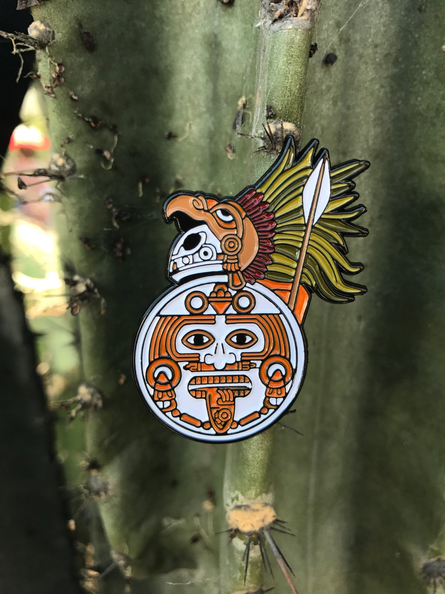

# Basic Concepts

## Political Concepts

### Āltepētl

**Āltepētl** is a pre-Hispanic state in *Nahuatl*.

### Cihuātlahtoān

**Cihuātlahtoāni** is a female ruler, or queen regnant. Synonym to **Tlatoani**, but female.

### Cuauhtlatoani

**Cuauhtlatoani** refers to the "vice-leader".

### Tlatoani

**Tlatoani** is the *Nahuatl* term for the ruler of an *āltepētl*, a pre-Hispanic state.

**Taltoani** may be translated into English as "king".

## Warfare Concepts

### Cuachicqueh

**Cuachicqueh** is the **Nahuatl** term for "the shorn ones". This was the most prestigious warrior society in Aztec empire.

### Cuāuhocēlōtl

**Cuāuhocēlōtl** is the derivative of eagle warrior and jaguar warrior, a jaguar knight.

The jaguar motif was due to the Aztec belief that the warrior would exhibit the jaguar's strength in battle.

To get to the **cuāuhocēlōtl** level, a warrior would have to capture 4 living enemies from battle, as they believed killing was a clumsy solution to battle.

### Tlachtli

**Tlachtli** is kind of like basketball. Games similar to basketball have been played all over **Mesoamerica** by the Aztec.

The objective of **Tlachtli** is to put a ball through a hoop made of stone at one end of the court. Unlike basketball, players cannot use their hands.

### Tlacochcalcatl

**Tlacochcalcatl** was an Aztec military title or rank; roughly equivalent to the modern title of **General**.

In Aztec warfare, **Tlacochcalcatl** was second in command only to the *tlatoani* and he usually would lead the Aztec army into battle when the ruler was otherwise occupied.

[Images](https://www.google.com/search?q=tlacochcalcatl&newwindow=1&source=lnms&tbm=isch&sa=X&ved=0ahUKEwjJxLyBpvbhAhVHWq0KHcViAlkQ_AUIDigB&biw=1920&bih=885) of **Tlacochcalcatl**.

[Back home](../README.md)