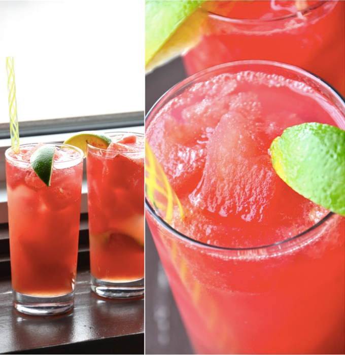

# Cocktails

## Jägermeister

### Jägerita

Ingredients:

* ½ part Jägermeister
* 1 part Tequila
* ½ part Cointreau
* 1 part Lime Juice
* Serve in cold coupe glass

Instructions:

1. Shake all ingredients on ice
2. Strain into a cold coupe glass

### Jägermeister Paloma

Ingredients:

* 1 ½ oz Jägermeister
* 1 oz fresh pink grapefruit juice
* ½ oz fresh lime juice
* ½ oz agave nectar
* Fill with Izze grapefruit soda
* 1 grapefruit peel garnish
* Serve in highball glass

Instructions:

1. Combine all ingredients except the grapefruit soda in shaker
2. Add ice and shake
3. Strain over fresh ice
4. Fill with grapefruit soda, and stir lightly
5. Garnish with grapefruit peel

### Jägermeister Old Fashioned

Ingredients:

* 1 part Jägermeister
* 1 ½ part Bourbon
* Orange or lemon zest
* Serve in rocks glass

Instructions

1. Stir ingredients in a shaker
2. Shake gently
3. Strain into a rocks glass filled with ice

## Rum

### Mojito

Ingredients:

* 1½ oz Rum, white
* 6 mint Leaves
* ¾ oz simple syrup
* ¾ oz fresh lime juice
* 1½ oz club soda

Instructions:

1. In a shaker, lightly muddle the mint leaves
2. Add the symple syrup, lime juice and rum
3. Fill with ice
4. Shake well and pour (unstrained) into a highball glass
5. Top with club soda and garnish with a mint sprig

### Watermelon Coconut Limeade

Makes 2 servings

Ingredients:

1 small seedless watermelon
2 medium limes
2 shots white rum (Malibu)
2 tbsp coconut sugar
2 liter club soda

Instructions:

1. Slice 3/4 of a seedless watermelon into cubes, reserving one quarter for juice
2. Place watermelon cubes in a bag and freeze for several hours or preferably overnight (enough watermelon cubes for at least 4 drinks)
3. In a strainer over a bowl, press the remaining chunks of fresh watermelon with a muddler or flat surface until most of the juice is extracted
4. Slice limes into quarters and squeeze the juice of one fruit into each serving glass, throwing the limes into the glass along with it (use half of a lime instead of 2 medium limes if you prefer a drink that's not as tart)
5. Add 1 tbsp coconut sugar and one shot of white rum to each serving glass (omit the sugar if you prefer it tart)
6. Muddle until well mixed
7. Fill to the brim with watermelon ice cubes (if your watermelon isn't frozen, just add in a few actual ice cubes to chill the drink)
8. Add a healthy splash of watermelon juice (about 1/4 cup)
9. Top off with club soda
10. Stir, garnish with lime wedge, and serve with a straw

## Vodka

### Cosmopolitan

Ingredients:

* 1 ½ oz Vodka, citrus
* 1 oz Cointreau
* ½ oz fresh lime juice
* 1 dash cranberry juice

### Fuzzy Navel

Ingredients:

* 1 oz Vodka
* 2 oz Peach Schnapps
* 3 oz orange juice

### Moscow Mule

Ingredients:

* 1½ oz vodka
* ½ oz lime juice
* ice cubes
* ½ cup ginger beer
* 1 lime wedge (garnish)

### Moscow Mule (strawberry mint)

Ingredients:

* 1½ oz vodka
* 3 mint leaves
* ½ oz strawberry shrub syrup
* ½ oz lime juice (~half a lime)
* ice cubes
* ½ cup ginger beer
* 1 mint sprig (garnish)
* 1 lime wedge (garnish)

Instructions:

1. Use a moscow mule cup and muddle the 3 mint leaves in it
2. Fill cup with ice
3. Pour vodka, strawberry shrub syrup, lime juice to cup
4. Add the ginger beer and stir mildly
5. Garnish with mint sprig and lime wedge
6. Enjoy!

### Screwdriver

Ingredients:

* 1 ½ oz Vodka
* ½ cup orange juice

### Sex on the Beach

* 1½ oz Vodka
* ½ oz Peach schnapps
* 1½ oz orange or pineapple juice
* 1½ oz cranberry juice
* ½ oz Chambord or Crème de Cassis (optional)

## Tequila

### Black Widow

* 1 ½ oz Tequila blanco
* 2 blackberries
* 3 basil leaves
* 1 oz fresh lime juice
* 1 tsp agave nectar

### Margarita

Ingredients:

* 1½ oz Tequila blanco
* 1 oz Cointreau, Triple Sec or another orange liqueur
* ¾ oz fresh squeezed lime juice
* Kosher salt (optional)

### Paloma

Ingredients:

* 2 oz Tequila blanco
* 1 oz fresh grapefruit juice
* ½ oz fresh orange juice
* 1 ½ oz grapefruit soda, such as Jarritos
* Splash of lime juice
* Grapefruit slice, for garnish

### Tequila Sunrise

Ingredients:

* 1½ oz Tequila reposado, chilled
* 4 oz fresh orange juice
* 1 dash Grenadine

## Whiskey

### Great North Woods

Ingredients:

* 2 oz Canadian whiskey
* ½ oz lemon juice
* ½ oz maple syrup
* 5 dashes Angostura bitters
* 1 splash soda water
* 1 lemon slice (garnish)
* 1 mint sprig (garnish)

Instructions:

1. Combine maple syrup, lemon juice and whiskey in shaker
2. Shake, then strain over ice in a mason jar
3. Add the splash of soda water on top for fizziness
4. Finish with bitters, slice of lemon and mint sprig

### Manhattan

Ingredients:

* 2 oz Rye Whiskey
* 1 oz Sweet Vermouth
* 5 drops Angostura bitters

### Old Fashioned

Ingredients:

* 2 oz Bourbon
* 1 sugar cube
* 3 dashes Angostura bitters
* 1 orange wheel
* 1 Maraschino cherry
* 1 splash club soda

[Back home](../README.md)