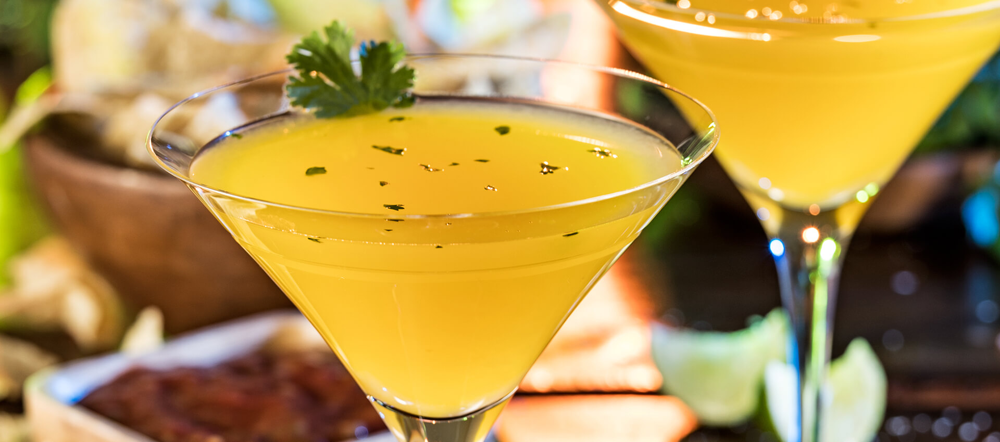

# Tequila Cocktails

## Mango Cilantro Martini

Description: a martini with sweet, tangy mango and bright green cilantro. A colorful favorite to brighten up any day.

Ingredients:

- 1 1/2 oz tequila blanco
- 1/2 oz orange liqueur
- 3/4 oz real mango puree
- 3/4 oz fresh lime juice
- 1 cilantro sprig

Instructions:

1. Tear and drop cilantro sprig into cocktail shaker
2. Fill cocktail shaker with ice
3. Pour tequila, orange liqueur, mango puree and fresh lime juice into cocktail shaker
4. Shake cocktail shaker vigorously for 15-20 seconds
5. Garnish with a fresh cilantro sprig and/or a lime wheel