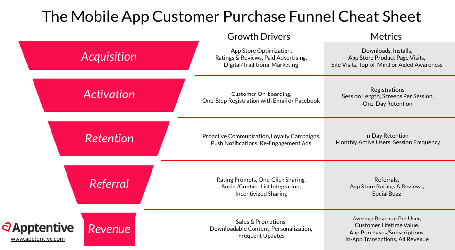

# Customer Lifecycle and Analytics

## Pirate Metrics

If you haven't heard of Pirate Metrics, it is an easy way to break down the different steps of a **customer lifecycle** that can be optimized.

* **Acquisition**: drive users to your site through various channels and get them to sign up
* **Activation**: engage users early on by having them participate with your most important feature(s)
* **Retention**: get users to come back, visit and use your product multiple times
* **Referral**: leverage users who are jazzed about your product to refer family and friends
* **Revenue**: convert users to pay you money for your services or product

### Acquisition

* Advertising / retargeting
  * Facebook ads
  * Twitter ads
  * Google Adwords
  * Bing ads
* Attribution
* Conversion optimization

### Activation

* Marketing automation
* Funnel analysis
* Heatmapping

### Referral

* Referral management

### Retention

* Marketing automation
* Push notifications
* Customer communication
* NPS, surveys
* Customer success
  * Zendesk
  * Freshdesk
  * Desk

### Revenue

* CRM
  * Salesforce
  * Capsule CRM
* eCommerce analytics

## Qualitative and Quantitative Analytics

### Qualitative Analytics

Qualitative tools give you unstructured customer feedback. These tools are great because they allow you to talk to your users, or get a deeper understanding of how a user is using your product.

It is suggested to use these tools for **product development**, when you are exploring new types of features and working to understand how customers are using your existing product in detail.

Some tools include:

* Surveys / NPS (Net Promoter Score)
* Live chat
* Heat mapping

### Quantitative Analytics

Quantitative analytics, on the other hand, give you hard facts about how users are using your product.

These are great for helping you understand higher level trends in product usage, and they do the heavy lifting when it comes to calculating sums, cohorts, and funnels.

If you want to see an overview of customer behavior, then these are your tools to use:

* Web analytics
  * Google Analytics
* Behavioral analytics
* A / B testing

[Back home](../README.md)