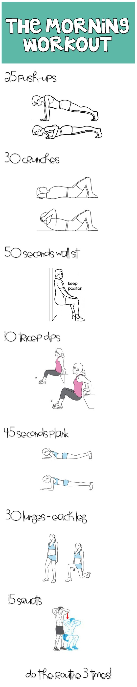

# Cardio Workouts

## 3 Mile Challenge

Boost strength and endurance.

1. Crank out as many push-ups as you can.  Rest for 1 minute.
2. Do 1 set of chin-ups, completing your maximum number of reps, and rest for 1 minute.
3. Do 1 set of dips, completing your maximum number of reps, and rest for 1 minute.
4. Go for a 3-mile run.

## High-speed Rope Circuit

Alternate between jumping rope and doing strength exercises.

1. Skip rope for 20 seconds.
2. Do 8 walking lunges forward, then turn around, and lunge back to the starting position (8 reps).
3. Skip rope for 20 seconds.
4. Do as many push-ups as you can (to failure).
5. Skip rope for 20 seconds.
6. Sprint for 500 meters.
7. Do pull-ups to failure.

## Hoops Fat Blaster Circuit

Use a basketball court to start this circuit at one baseline, basket to basket, do the exercise, then run as fast as you can to the other baseline.

1. Sit at one baseline, and hold a basketball in front of your chest.  Stand up and sit down without letting your arms, hands, or the ball touch the floor.  Repeat 10 times, then sprint to the other baseline.
2. Assume a push-up position, but with one hand on the ball. Perform a push-up, then roll the ball to the other hand and repeat. That’s 1 rep. Aim for 10, and then sprint to the other baseline.
3. Hold the top of a push-up on the ball for 1 minute. Rest for 30 seconds.
4. Repeat circuit for at least 3 times.

## AM Workout

1. Do 24 body-weight squats.
2. Do 24 body-weight lunges.
3. Complete 24 jump lunges.
4. Do 24 jump squats.
5. Hold a plank for 2 minutes.
6. Do 24 push-ups.
7. Do 24 burpees.
8. Do 24 jumping jacks.
9. High-knees for 24 seconds.
10. Relax.

Or a variation of the same AM workout...

