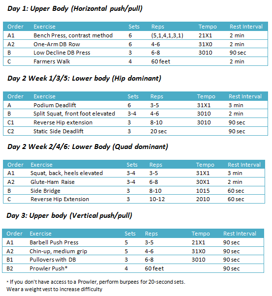
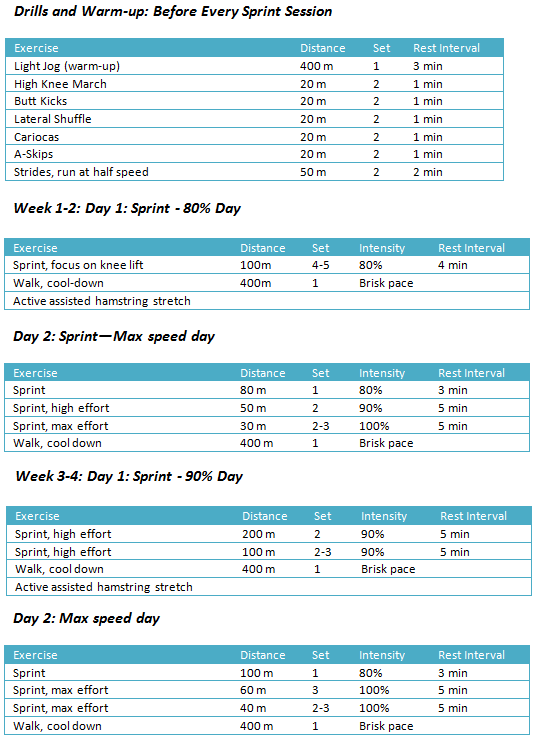

# Sprint & Weight Training

Sprinting is one of the few fat burning activities that can actually build muscle tissue instead of catabolizing it, and it’s easy to do; just find a track and run!

Sprinters possess the perfect storm of fast-twitch dominance, exceptional reaction time, great work capacity, and a favorable endocrine profile.

## Weight Training

## Example of a Pro Schedule

The following program outlines the typical pre-season training schedule of Darvis “Doc” Patton, #5 ranked 100-meter sprinter of 2009 (Track workout designed by Monte Stratton, coach of multiple Olympic sprinters).

* Monday (10am): Track work: speed-endurance (300m, 200m, 100m)
* Monday (2pm): Upper body strength training
* Tuesday (10am): Track work: block starts (2 x 10m, 2 x 20m, 2 x 30m, 1 x 50m) or speed work
* Tuesday (2pm): Lower body quad dominant strength training (squats, knee flexors, hip flexors)
* Wednesday: Soft Tissue therapy/ Massage
* Thursday (10am): Track work: speed day (5 x 60m) or (4 x 90m) or (3 x 120m) w/ 10 minute rest interval
* Thursday (2pm): Upper body strength training
* Friday (10am): Track work: speed endurance (3 x 150m) or (4 x 120m) or (180m, 150m, 120m)
* Friday (2pm): Lower body hip dominant strength training (deadlifts, split squats, hip flexors)

Now that you've seen a pro schedule, we can tackle an average joe's schedule.

## Example of Average Joe Schedule

You’ll sprint twice a week, and weight-train three days a week. You’ll perform a heavy maintenance session for legs once per week for the six-week cycle.

* Monday: Upper body: Horizontal push/pull
* Tuesday: Sprints
* Wednesday: Rest
* Thursday: Legs (alternate quad and ham dominant days)
* Friday: Upper Body: Vertical push/pull
* Saturday: Sprints
* Sunday: Rest

## Warm-Up and Stretch Descriptions

### High Knee March

* Move briskly for about 20 steps, lifting the knees as high as you can with each step.
* Pump your arms.
* Stay on your toes throughout.

### Butt Kicks

* Kick your heels up to touch your bum.
* Stay on your toes and pump your arms.
* Works the hamstrings and stretches the quads.

### Lateral Shuffle

* Squat down until your thighs are approximately parallel to the floor. Keep the chest up.
* While maintaining this position, quickly shuffle sideway for about 10 steps and immediately return with the same amount of steps.

### Cariocas

* Move briskly sideways, crossing the trailing leg in front.
* Uncross the legs and move the trailing leg behind.
* Increase the speed as you get the hang of the footwork.

### A-Skips

* Similar to a High Knee March but performed explosively (like a skipping motion with an explosive element).
* Raise kness and pump arms, and dorsiflex foot (lift toe).
* Drive ball of landing foot into the ground.

### Active-Assisted Hamstring Stretch

* Lie supine (on your back) with a small rolled-up towel under your low back.
* Actively initiate hip flexion; once you reach the limit of your active range of motion use a strap to deepen the stretch by pulling the leg a few inches farther.
* Hold for 2 seconds; repeat until 6 reps are complete.
* You will feel mild pain in the hamstring on each rep.
* Your non-working leg should be in contact with the floor and completely straight with toe pointing towards ceiling.
* Sets: 3/leg
* Reps: 6 reps (Photos at right)

## Intensity definitions

Running at 80% should not make you feel strained. 

Running at 90% intensity is running at full speed under control. You’re running as fast as you can while maintaining good body position (no arm flailing, neck and face are relaxed).

Running at 100% requires you to focus on applying as much force to the ground as possible.

## Notes on sprinting workouts

You may notice I don’t recommend any distance over 200 meters. This is because I want you to focus on working within the short term and intermediate energy system (anaerobic alactic and lactic system). All sprints should take less than 30 seconds to complete. If you have less than 10% body fat and can’t run 200 meters in less than 30 seconds, you’re in sorry shape, my friend.

Arm position: arms at 90 degrees, and your hands should pass your pants pockets during each stride.

[Back home](../README.md)
