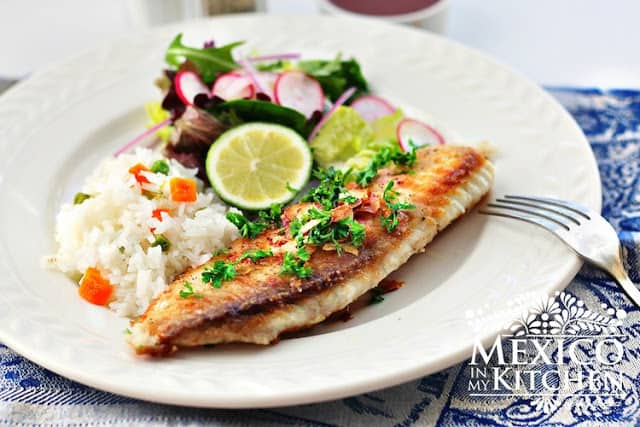

# Tilapia al mojo de ajo

## Ingredients

- 3 - 4 tilapia fillets
- 1 or 2 limes
- salt and pepper to taste
- 1/4 cup vegetable oil (or a mix of half olive oil and half vegetable oil)
- 6 garlic cloves thinly sliced
- 3 tbsps parsley, finely chopped
- 2 tbsps all-purpose flour, or to taste
- Optional, butter

## Instructions

1. Season fish with salt, pepper and lime juice for about 30-45 minutes
2. Peel garlic and chop in thin slices
3. Heat oil over low heat in a large frying cast iron skillet
4. Once hot, fry the garlic slices until they're golden
5. Make sure to remove garlic slices promptly, once they're lightly golden
  - If you leave them longer, they will get a bitter taste
  - This step takes a few seconds, about 30-45 seconds
  - Optional: in the last few seconds, put 1/2 tbsp butter
6. Once garlic is lightly golden, remove garlic along w/liquids and set aside in a bowl
7. Dust the fish with flour, lightly, about two big pinches each side
  - First dust one side, and start cooking the side with the flour, while the fish is cooking, dust the undusted side that is up with 2 big pinches of flour
8. Finely chop parsley  
9. Put fish on skillet where garlic was cooked
10. Cook each side for about 3-5 minutes if 1/3 inch thick
  - If thicker, increase time until all edges are golden brown
11. DO NOT turn fish until every side is golden and cooked, so only cook each side once
12. Remove fish from skillet and place on a plate lined with a napkin to absorb a bit of the grease
13. Optional: melt 1 or 2 tbsps, depending on fish fillet quantity, in microwave
14. Add bits of garlic slices to the fish that is ready on the plate lined with napkins, and if using butter, drizzle fish and garlic slices with melted butter
15. Serve garnished with chopped parsley, and if you want and have extra, more garlic and butter
