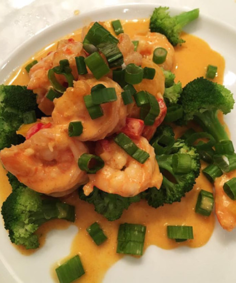

# Coconut Shrimp Curry Bowl

Serves 2

## Ingredients

- 16 oz shrimp, deveined
- 4 tbsps olive oil
- 4 scallions, chopped (seperate whites and greens)
- 1 tbsp Thai red or green curry paste
- 2 clove garlic
- 1 red pepper, chopped
- 1 cup coconut milk
- 2 tsp tamari
- 4 tbsps fresh cilantro, chopped
- sea salt to taste
- fresh lime (optional)

## Instructions

1. In a large skillet, heat olive oil on medium
2. Add scallion whites, curry paste and sauté for 1 minute
3. Add shrimp, red pepper and garlic, season with salt and cook until slightly golden
4. Add coconut milk and tamari, mixing well
5. Simmer for 5 minutes
6. Remove from heat
7. Mix in scallion greens and cilantro
8. Add a squeeze of fresh lime for extra flavor
