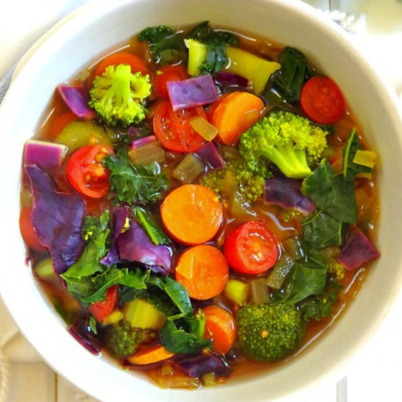

# Cleansing Detox Soup

This soup contains all the veggie vitamin power you need plus the anti-inflamatory properties of turmeric, the blood sugar balancing of cinnamon, immune-boosting ginger and lemon and cayenne to rev up the metabolism.

## Ingredients

- 1/4 cup of water (or vegetable broth)
- 1/2 of a red onion, diced
- 2 cloves garlic, minced
- 3 celery stalks, diced
- 3 medium carrots, diced
- 1 small head of broccoli, florets
- 1 cup chopped tomatoes
- 1 tablespoon fresh ginger, peeled and minced
- 1 teaspoon turmeric (powdered)
- 1/4 teaspoon cinnamon
- 1/8 teaspoon cayenne pepper (or to taste)
- fine-grain sea salt and black pepper to taste
- 6 cups water (or 4 cups vegetable broth + 2 cups water)
- 2 cups kale, de-stemmed and torn in pieces
- 1 cup purple cabbage
- juice from 1/2 of a small lemon (or a whole lemon, depending how much lemon flavor you prefer)

## Instructions

1. In a large pot, add the water and turn on the heat to medium-high
2. After it's hot, add the onion and garlic in pot with water
3. Sauté for 2 minutes, stirring occassionally
4. Add the celery, carrots, broccoli, tomatoes and fresh ginger
5. Stir and cook for 3 minutes, adding in extra water or broth as needed (another 1/4 cup)
6. Stir in the turmeric, cinnamon, and cayenne pepper plus salt and pepper to taste
7. Add in the water or vegetable broth and bring to a boil
8. Reduce heat and simmer for 10-15 minutes or until vegetables are soft
9. Add in the kale, cabbage and lemon juice near theh last 2-3 minutes of simmering

## Notes

- This cleansing receipe is oil-free because avoiding the use of oil during a cleansing meal is important for the detoxification process (and you won't miss the oil at all due to all the flavor), but if you feel like cooking with oil, use a minimal amount - 1 tablespoon or less
- Leftovers stay well in the refrigerator for up to 3 days
