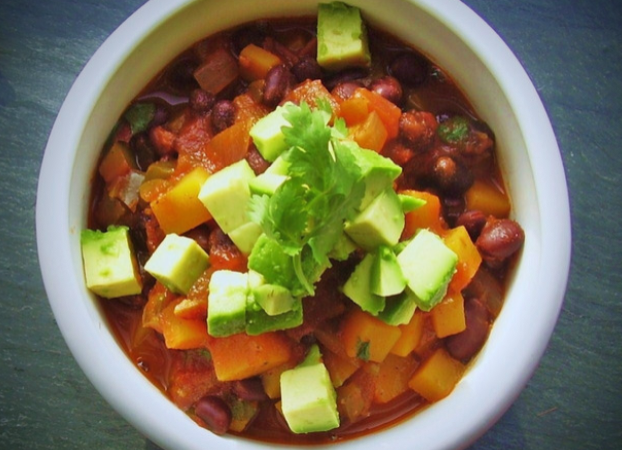

# Black Bean and Butternut Squash Chili

Serves 3-4

## Ingredients

- 2 tbsps extra virgin olive oil
- 1 medium-sized red onion, diced
- 1 large red bell pepper, chopped finely
- 18 oz cooked black beans, drained
- 1 small jalapeño, minced
- 2 clove garlic, squeezed
- 1.5 cup vegetable broth
- 2 tsps apple cider vinegar
- 15 oz can crushed tomatoes
- 2 cups diced butternut squash
- 2 tsps chili powder
- 2 tbsps fresh cilantro, chopped
- ground cinnamon to taste
- sea salt to taste

## Instructions

1. Heat the oil in a large saucepan over medium heat
2. Add onion, bell pepper and jalapeño
3. Sautéfor a few minutes until the onion is lightly caramelized
4. Add garlic and sautéfor another 30 seconds
5. Add broth, vinegar, butternut squash, tomatoes, chili powder, cinnamon, and salt
6. Bring to a boil over high heat
7. Reduce the heat to low, cover and let simmer until all of the vegetables are softened, about 25 minutes
8. Stir in the beans and let simmer uncovered over low heat, stirring occasionally, until the desired consistency is reached about 10 minutes
9. Stir in chopped cilantro and adjust seasoning
10. In a bowl, season the avocado with
lemon juice, olive oil, chopped cilantro and chopped spring onions
11. Add salt and pepper to taste and toss well
12. Serve the chili in bowls
13. Top with seasoned avocado and garnish with cilantro sprigs
