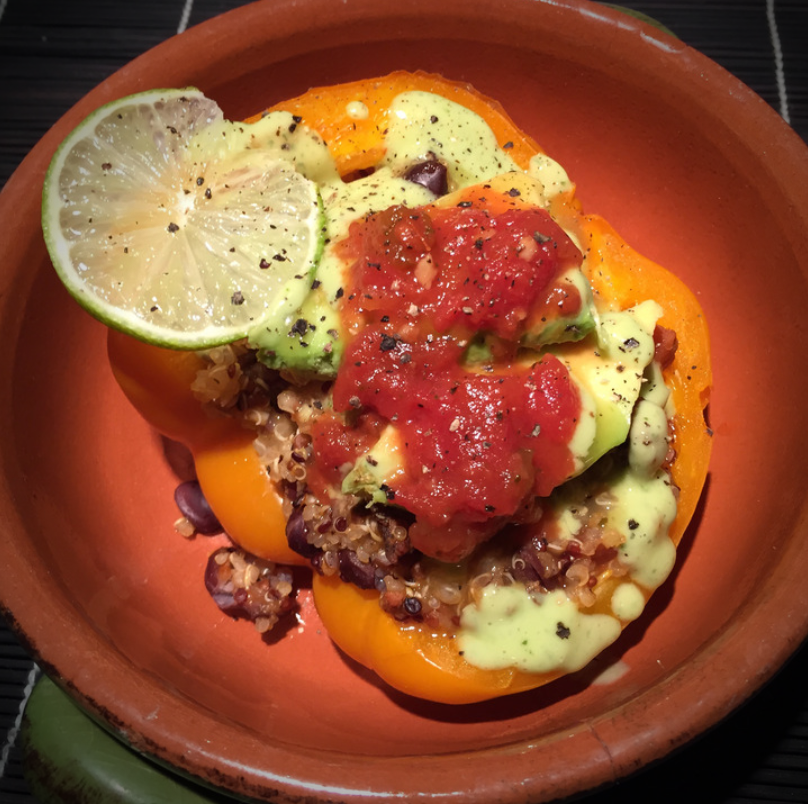

# Spanish Quinoa Stuffed Peppers

Serves 2

## Ingredients

- 1/2 cup dry quinoa, thoroughly rinsed and drained
- 1 cup vegetable stock
- 2 large orange bell peppers, halved w/out seeds (red or yellow)
- 1/4 cup salsa (plus more for serving)
- 1/2 tbsp nutritional yeast
- 1 tsp cumin powder
- 3/4 tsp chili powder
- 3/4 tsp garlic powder
- 1/2 can (15 oz) black beans drained (if unsalted, add 1/4 tsp salt)

## Toppings

- 1/2 ripe avocado, sliced
- fresh lime juice
- hot sauce
- cilantro, chopped
- red onion, chopped

## Creamy Cilantro Dressing

- 1/4 small ripe avocado
- 1/2 cup chopped cilantro
- 2 small limes juiced
- 1/4 cup extra virgin olive oil
- 1/8 tsp sea salt
- 1/8 tsp cumin powder
- 1/2 tbsp honey
- water to thin

## Instructions

1. Add quinoa and vegetable stock to a saucepan and bring to a boil over high heat
2. Once boiling, reduce heat, cover, and simmer until all liquid is absorbed and quinoa is fluffy - about 20 minutes
3. Preheat oven to 375 degrees F and lightly grease a 9x13 baking dish or rimmed baking sheet
4. Brush halved peppers with a neutral, high heat oil, such as avocado or refined coconut
5. Add cooked quinoa to a large mixing bowl and add remaining ingredients
6. Mix to thoroughly combine then taste and adjust seasonings accordingly, adding salt, pepper, or more spices as desired
7. Generously stuff halved peppers with quinoa mixture until all peppers are full, then cover the dish with foil
8. Bake for 30 minutes covered, then remove foil, increase heat to 400 degrees F, and bake for another 15-20 minutes, or until peppers are soft and slightly golden brown
9. For softer peppers, bake 5-10 minutes more
10. Serve with desired toppings (listed above) or as is
11. Best when fresh, though leftovers keep covered in the refrigerator for 2-3 days
12. Reheat in a 350 degree oven until warmed through - about 20 minutes