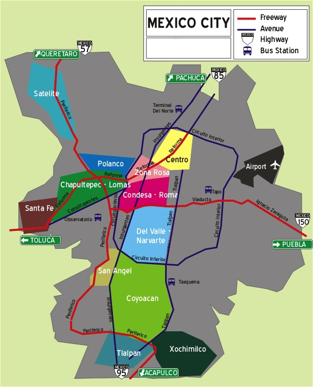

# Ciudad De Mexico - CDMX

* Google Maps - cdmx-mx
    * https://www.google.com/maps/d/u/1/edit?hl=en&mid=1kvq4jUcMZPumXCj0kPFQDMjdMKTFfAs&ll=19.476682757504605%2C-99.02448394999999&z=11
* CDMX Secreta - local articles about CDMX
    * https://cdmxsecreta.com
    * Semana santa events
        * https://cdmxsecreta.com/semana-santa-cdmx/
* Condé Nast Traveler - articles about CDMX
    * https://www.cntraveler.com/destinations/mexico-city
* Bon Appetit - articles about CDMX
    * https://www.bonappetit.com/city-guides/package/mexico-city

## Before You Go

* Check out IG:
  * #CDMX
  * #CDMXfood
  * #CDMXbars
  * #CDMXparty
  * #CDMXnightlife

## Important Notes

* AVOID THE METRO DURING RUSH HOUR between 7-10AM and 6-9PM
* SCAMMER ALERT:
    * Watch out for scammers speaking almost perfect English asking for money
        * They are mostly scammers abusing “gringos”
* MUSEUMS ARE CLOSED ON MONDAYS

## Neighborhoods

* Insurgents is the main north-south road that cuts through the ‘hoods below
* Reforma goes diagonally, southwest to northeast, from Chapultepec, through Zona Rosa, and El Centro Historico
  * From 8AM to 2PM on Sundays, Reforma is closed for pedestrians and cyclists

### Condesa

* Hipster
* Boho-chic
* “Coolest neighborhood in CDMX”
* Best cafes and bars walking distance
* Delicious restaurants nearby
* Walking distance to Chapultepec Park and Roma neighborhood

### Roma Norte

* Hipster
* “La Condesa’s younger, more rebellious sister”
* Artisanal beer taprooms and breweries
* Amazing restaurants
* Shopping and art galleries
* Originally a middle-class residential neighborhood, it was left destroyed after a massive earthquake rocked Mexico City in 1985

### Polanco

* Expensive and fancy
* Fancy restaurants like Pujol and Quintonil
* Museo Nacional de Antropologia
* Museo Jumex (contemporary art)
* Museo Soumaya (classical and modern art)
* Great hotels to stay at

### Colonia San Angel

* Quaint and artsy neighborhood w/2 beautiful plazas, shops, and some art galleries
* Big houses with many big trees on Francisco Sosa Avenue
* Off-the-beaten-path compared to the other top 2 ‘hoods
* El Bazar on Saturdays is the main attraction with art, jewelry, clothing, etc.
* Museo Casa Estudio Diego River y Frida Kahlo
* Mercado del Carmen is an open-air food hall with cocktails
* Not recommended to stay here as it is far away from Condesa and Roma

### Centro Historico

* Oldest neighborhood and culture-packed
* A lot of places of interest:
  * El Zocalo
  * El Palacio Nacional
  * Catedral Metropolitana
  * Palacio de Bellas Artes
  * El Templo Mayor
* Great restaurants
* Not recommended to stay here as it is not that safe at night
  * Guerrero at night, north of Centro Historic, is a bit sketchy at night

### Coyoacan

* Artsy
* Mercado de Coyoacan with food vendors, art, clothing, souvenirs, etc.
* Frida Kahlo Museum AKA the Blue House
* Stay in this ‘hood if you want to chill and relax as it is a bit more calm at night

### Xochimilco

* Lovely churches, tiny alleyways and colorful streets
* Get on a boat to ride through the ancient canals
* Best day to go is on a Sunday afternoon and hire a “trajinera” to row you around
* Micheladas, elote, enchiladas, tacos, mariachi, boats, it’s a party

### Colonia Juarez

* Up and coming ‘hood located north of Roma Norte
* Budget friendly to stay in but a bit farther from Condesa and Roma Norte
* Known as a “concrete jungle”
* Eclectic, artsy and super hipster with local vibes
* Great spots to explore on foot and enjoy a few cocktails - day and night

### Colonia San Rafael

* Hipster, and an underrated treasure in CDMX
* Off-the-beaten path kinda vibe
* Beautiful art deco apartment buildings
* Great local taco stands and restaurants
* Museo Experimental El Eco
* Mercado de San Cosme, a historic public market

### San Miguel Chapultepec

* Bordering Condesa south, and el Bosque de Chapultepec to the east, is this charming, local ‘hood
* Traditional restaurants, markets and street food stalls
* Mostly locals, so if you stay here, you’ll prob stick out, but it is still a great experience
* Bosque de Chapultepec main attraction
* Art galleries and specialty shops

### Zona Rosa

* Fun, grimy, party-your-face-off scene
* Karaoke bars, salsa clubs, sports bars, cocktail bars, live music, busy nightclubs, etc
* Not the safest ‘hood at night
* Little Korea
* Paseo de la Reforma
* Monumento de la Independencia where revolutionaries are buried, including Miguel Hidalgo

### Colonia Santa Maria la Ribera

* Aire hipster, and the “next Roma” since its gentrification, but it still got ways to go
* North of Zona Rosa, west of Centro between Insurgentes and the Circuito Interior avenues

### Narvarte

* A local, middle class ‘hood
* Known for its great street food
  * El Vilsito featured on Netflix’ Taco Chronicles

### epito

* A bit questionable, so dress down and act cool
* Great cheap shops
* Find more about “La Ruta de la Garnacha”

## Tentative Experiences

* AirBnB - CDMX 2024 Wishlist
  * https://www.airbnb.com/wishlists/1440271965
* Fever - The Marshmallow Mansion immersive cocktail experience $800 MX per person
  * https://feverup.com/m/132763
* AirBnB - Mezcal Tasting $60 per person
  * https://www.airbnb.com/experiences/100246
* Mis Mezcales - mezcal tasting $450 MX per person
  * https://www.mismezcales.mx/reservaciones
* Club Tengo Hambre - Food tour with a local $90 per person
  * https://clubtengohambre.com/mexicocitystreetfoodessentials
* Eat Like A Local - Food tours with a local $110 per person
  * https://eatlikealocal.com.mx/
* Viator - Street food tour on a bike and walking with a local $75 per person
  * https://www.viator.com/tours/Mexico-City/Street-food-tour-with-Friends/d628-227508P1?pid=P00038377&mcid=42383&medium=link&campaign=4daysMexicoCity
  * Code: QC4XU27TKK86 for $25 off
* Perto - Bike ride and food tour $1,245 MX
  * https://en.perto.com/mx/ciudad-de-mexico-121542/amsterdam-279-785458/food-bikes-mexico-is-not-only-tacos-7903380/

## Motavation

https://traceyparkertravel.com/marijuana-in-mexico-city/

Places where you can smoke:
* La glorieta del metro insurgentes en la salida que da a la calle Oaxaca
* La plaza de la información del metro hidalgo
* Parque Las Américas, en Diag. San Antonio 1737, Narvarte Oriente, Benito Juárez
* Polanco al frente del senado
* Plantón 420, ubicado en Av. Paseo de la Reforma 135, Colonia tabacalera, en la alcaldía Cuauhtémoc
* Casa Tlaxkoa saliendo del Metro Pino Suarez, plaza de la memoria

## Events

* Axe Ceremony 2024 with Kendrick Lamar
  * https://www.songkick.com/festivals/3512779-axe-ceremonia/id/41543658-axe-ceremonia-2024

## Links

* Travel + Leisure - 26 best things to do in CDMX
  * https://www.travelandleisure.com/attractions/best-things-to-do-in-mexico-city
* Travel + Leisure - a thorough basic guide on the best restaurants, hotels and other useful tips about neighborhoods in CDMX
  * https://www.travelandleisure.com/travel-guide/mexico-city
* Hollywood Reporter - a celebrities’ list of places in CDMX including a bonus section with boutique hotel links at the end of it
  * https://www.hollywoodreporter.com/lifestyle/lifestyle-news/best-things-to-do-mexico-city-1235683603/
* GQ - a guide to La Condesa neighborhood in CDMX, saved most of them on the G map
  * https://www.gq.com/story/neighborhood-guide-condesa-mexico-city
* Where Goes Rose - a 5 day itinerary with a lot of description on ‘hoods and activities in every ‘hood for easy reference
  * https://www.wheregoesrose.com/5-days-mexico-city-itinerary/
* Wheatless Wanderlust - 4 days itinerary for first timers in CDMX
  * https://wheatlesswanderlust.com/4-days-in-mexico-city/
* Chilango - 8 best bars according to the best bartenders in CDMX
  * https://www.chilango.com/comida/mejores-cantinas-cdmx/
* Eater - A comprehensive list of restaurants updated last on December 2023
  * https://www.eater.com/maps/best-mexico-city-restaurants-38
* The Unconventional Route - A travel guide that pretty much repeats the same info as below links, but also offers other stand-along guides to specific things in Mexico City
  * https://www.theunconventionalroute.com/mexico-city-travel-blog/
* The Unconventional Route - A guide to ride around CDMX on an EcoBici, rented from an app
  * https://www.theunconventionalroute.com/ecobici-mexico-city-guide/
* The Unconventional Route - Dos and Dont’s no one tells you
  * https://www.theunconventionalroute.com/mexico-city-travel-tips/
* The Unconventional Route - How to eat like a local
  * https://www.theunconventionalroute.com/mexico-city-eat-like-a-local/
* Travel Mexico Solo - 51 unique things to do in CDMX, plus links for tours in different areas and attractions, as well as having links to itinerary examples for different amount of days
  * https://travelmexicosolo.com/non-touristy-things-to-do-in-mexico-city/
* Maddy’s Avenue - Great info on different neighborhoods in CDMX, plus other links with hotel recommendations in specific areas
  * https://maddysavenue.com/best-mexico-city-neighborhoods/
* Your Friend The Nomad - short guide to CDMX with the same as all the other blogs
  * https://yourfriendthenomad.com/roma-norte-cdmx/
* Texaz Taste - a general guide with food recs and hotel recs
  * https://www.texaztaste.com/blog/mexico-city-guide-where-to-sip-savor-sleep/
* Travel Mexico Solo - a 4 day itinerary with thorough guide on restaurants and activities
  * https://travelmexicosolo.com/4-day-mexico-city-itinerary/
